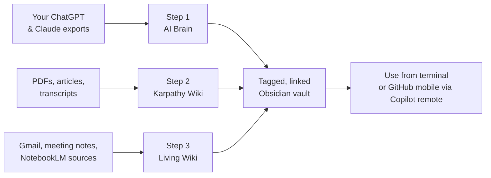

# AI Second Brain for GitHub Copilot CLI

> A GitHub Copilot CLI agent skill that walks you through building a living, searchable, AI-powered knowledge base from your ChatGPT and Claude history, raw research, and daily inputs.

This fork adapts Charlie Hills's original Claude Code skill for **GitHub Copilot CLI**. It keeps the same three-part workflow, but changes the install location, commands, and phone/automation guidance to match Copilot CLI.

---

## Install for GitHub Copilot CLI

Copilot CLI loads personal skills from `~/.copilot/skills/<skill-name>/SKILL.md`.

### Windows PowerShell

```powershell
New-Item -ItemType Directory -Force "$HOME\.copilot\skills" | Out-Null
git clone https://github.com/ericksoninco/ai-second-brain.git "$HOME\.copilot\skills\ai-second-brain"
```

### macOS or Linux

```bash
mkdir -p ~/.copilot/skills
git clone https://github.com/ericksoninco/ai-second-brain.git ~/.copilot/skills/ai-second-brain
```

If the target folder already exists, back it up or update it first.

### Verify it installed

Start Copilot CLI in any folder:

```bash
copilot
```

Then run:

```text
/skills reload
/skills info ai-second-brain
```

You can invoke it directly with:

```text
Use the /ai-second-brain skill to set up my AI second brain.
```

To update later:

```bash
cd ~/.copilot/skills/ai-second-brain && git pull
```

On Windows PowerShell:

```powershell
Set-Location "$HOME\.copilot\skills\ai-second-brain"
git pull
```

---

## What it does



The skill walks you through three stages. You can do all three or pick one.

1. **AI Brain** - exports your ChatGPT and Claude history and turns them into a tagged, linked Obsidian vault you can search by topic, project, or person.
2. **Karpathy Wiki** - sets up a `raw/` and `wiki/` folder pair plus an `AGENTS.md` instruction file so Copilot CLI can compile a living wiki from raw research.
3. **Living Wiki** - connects optional MCP tools, enables Copilot CLI remote control when available, and scaffolds reusable prompt templates for daily planning, ideas, and content creation.

Every step where Copilot CLI can do the work for you, it does. Every step that needs you - data exports, app installs, browser logins, OS permissions - pauses until you confirm.

## What you need before starting

- [GitHub Copilot CLI](https://docs.github.com/copilot/how-tos/use-copilot-agents/use-copilot-cli) installed and logged in
- An active GitHub Copilot subscription
- [Obsidian](https://obsidian.md) (free)
- About 30 minutes of attention, plus 1-3 days of background waiting for OpenAI to email your ChatGPT export

---

## Trigger phrases

The skill activates when you ask Copilot CLI anything like:

- "Use the /ai-second-brain skill to set up my AI second brain"
- "Build the Karpathy wiki"
- "Organize my ChatGPT conversations in Obsidian"
- "I exported my ChatGPT data, what now?"
- "Create reusable prompts for today, ideas, and content creation"
- "Set up an Obsidian knowledge base with Copilot CLI"

Already done part of it? Just say "skip step 1, I've already done it".

---

## Notes for Copilot CLI users

- Copilot CLI is launched with `copilot`, not `claude`.
- Project skills can also live in `.github/skills/<skill-name>/SKILL.md`, but this repo is intended to be installed as a personal skill under `~/.copilot/skills`.
- Copilot CLI supports repository instructions through `AGENTS.md`, `.github/copilot-instructions.md`, and `.github/instructions/**/*.instructions.md`.
- The original iMessage Channels workflow was Claude Code-specific. In Copilot CLI, use `/remote` for GitHub web/mobile remote control when available, or skip the phone step.
- Copilot CLI has built-in slash commands. This skill creates reusable prompt templates rather than claiming `/today`, `/ideas`, or `/create` are native custom slash commands.

---

## FAQ

**Does this send my data anywhere?**  
Your files live in folders on your machine. Copilot CLI sends prompt context to GitHub Copilot to run the model, so only add private exports and research if you are comfortable using them with Copilot under your account and organization policies.

**Will it read my email automatically?**  
No. It only connects to external tools if you configure an MCP server or connector and approve the relevant access.

**Can I uninstall it?**

Yes. Remove the skill folder:

```bash
rm -rf ~/.copilot/skills/ai-second-brain
```

On Windows PowerShell:

```powershell
Remove-Item -Recurse -Force "$HOME\.copilot\skills\ai-second-brain"
```

This removes the skill. It does not touch your Obsidian vault, raw folder, or wiki.

**Does it work on Windows?**  
Yes. Steps 1 and 2 work on Windows, macOS, and Linux. Copilot CLI remote/mobile features and MCP connectors depend on the tools you configure. The original iMessage-specific workflow is Mac-only and is not a Copilot CLI feature.

**Can I still use this with Claude Code?**  
The core workflow still works, but this fork's instructions are written for Copilot CLI. Use the upstream repository if you want Claude Code-specific install paths and Channels guidance.

---

## Credits

This fork adapts the original work for GitHub Copilot CLI while preserving the underlying workflow and credits.

- **[Charlie Hills](https://github.com/charlie947)** - created the original AI Second Brain skill and orchestration.
- **[Andrej Karpathy](https://github.com/karpathy)** - published the original living wiki gist.
- **Alex Freedman ([@alex2learn](https://instagram.com/alex2learn))** - created the AI Brain export-and-organize process adapted in Step 1.
- **[Greg Isenberg](https://www.youtube.com/@GregIsenberg)** - published the slash-command workflow that inspired the reusable prompt templates.

---

## License

MIT. Fork it, modify it, rebrand it - just keep the credits to the people whose work makes this useful.
